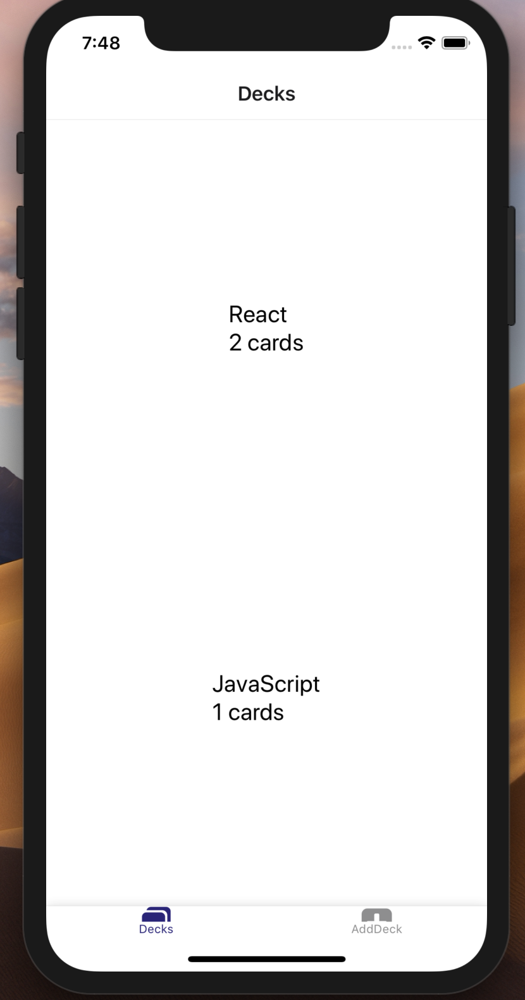
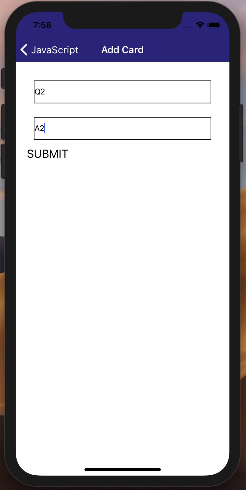
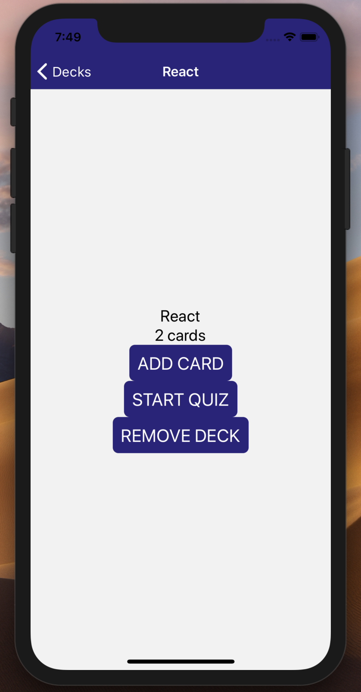
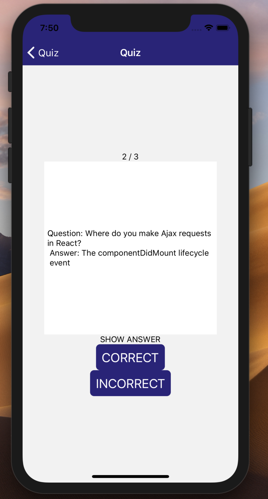
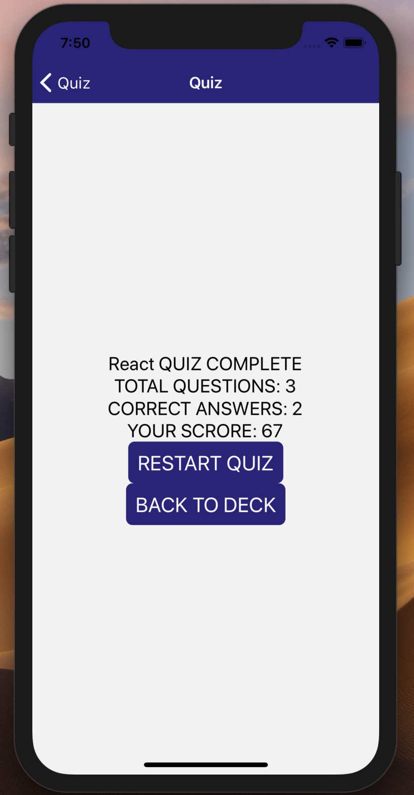

# Mobile Flashcards App
* App developed for the final Udacity React Nanodegree program.
* App demonstrates an ios app using React Native.

# Project Overview

Built a mobile iOS application that allows users to study collections of flashcards. The app will allow users to create different categories of flashcards called "decks", add flashcards to those decks, then take quizzes on those decks.

# Why this project?

This project encompasses the fundamental aspects of building a native application including handling infinite lists, routing, and user input. By building this project, we have gained an understanding of how to use React Native to build an iOS or Android application.

# To run the project
* Clone the repo to your local directory.
* Install all project dependencies with `yarn install`
* Start the ios simulator with `yarn ios`

# Screenshots

